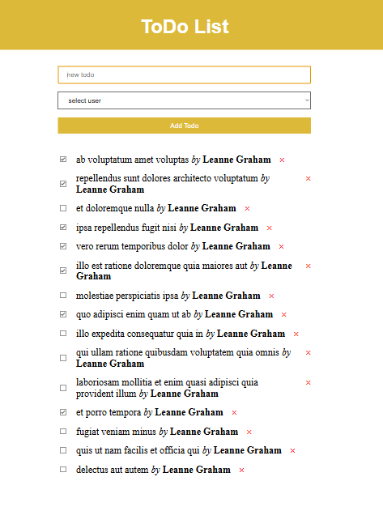

<h1 align="center">Todo list</h1>

## Description

The project aims to work asynchronously with a remote server. The todo list has been created with data about users and their todos being received, implemented adding, marking, and deleting todos.

## About the project.
- When the page loads, the user receives data from the remote server about todos and users.
- The todo is marked by sending a request to the server using the PATCH method.
- Todos are added by sending a request to the server using the POST method.
- Todos are deleted by sending a request to the server with the DELETE method.
- Dynamic rendering of todos and users in markup using the createElement method.

## **The page is loaded**

## **Deleting and adding a new todo**

## I invite you to see my other projects.
